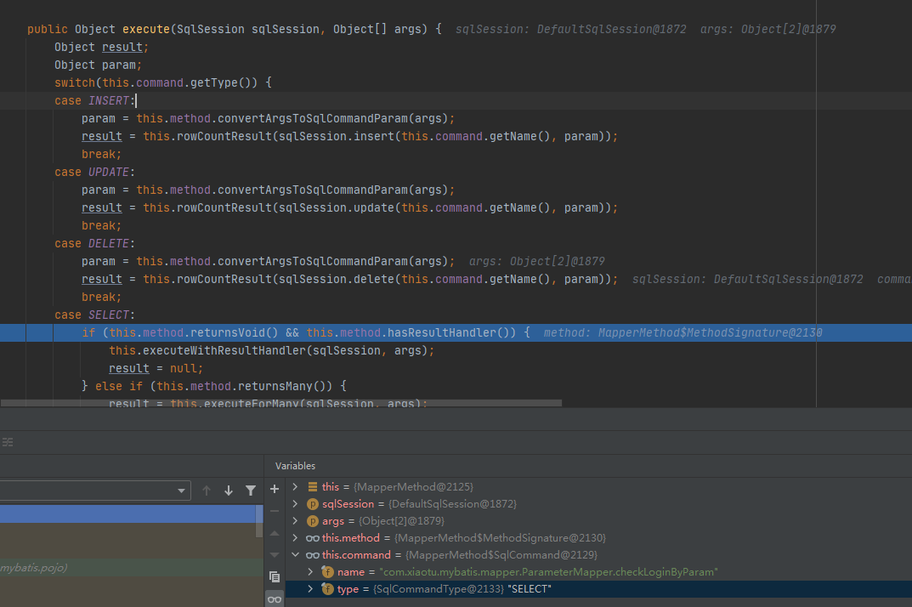

# 第一章 MyBatis简介

## 1、MyBatis历史

MyBatis最初是Apache的一个开源项目iBatis, 2010年6月这个项目由Apache Software Foundation迁移到了Google Code。随着开发团队转投Google Code旗下，iBatis3.x正式更名为MyBatis。代码于2013年11月迁移到Github
iBatis一词来源于“internet”和“abatis”的组合，是一个基于Java的持久层框架。iBatis提供的持久层框架包括SQL Maps和Data Access Objects（DAO）

## 2、MyBatis特性

1. MyBatis 是支持定制化 SQL、存储过程以及高级映射的优秀的持久层框架
2. MyBatis 避免了几乎所有的 JDBC 代码和手动设置参数以及获取结果集
3. MyBatis可以使用简单的XML或注解用于配置和原始映射，将接口和Java的POJO（Plain Old Java Objects，普通的Java对象）映射成数据库中的记录
4. MyBatis 是一个 半自动的ORM（Object Relation Mapping）框架

## 3、MyBatis下载

https://github.com/mybatis/mybatis-3

##  4、和其它持久化层技术对比

- JDBC
  SQL 夹杂在Java代码中耦合度高，导致硬编码内伤
  维护不易且实际开发需求中 SQL 有变化，频繁修改的情况多见
  代码冗长，开发效率低
- Hibernate 和 JPA
  操作简便，开发效率高
  程序中的长难复杂 SQL 需要绕过框架
  内部自动生产的 SQL，不容易做特殊优化
  基于全映射的全自动框架，大量字段的 POJO 进行部分映射时比较困难。
  反射操作太多，导致数据库性能下降
- MyBatis
  轻量级，性能出色
  SQL 和 Java 编码分开，功能边界清晰。Java代码专注业务、SQL语句专注数据
  开发效率稍逊于HIbernate，但是完全能够接受

# 第二章 搭建Mybatis

- IDE：idea 2020.2
- 构建工具：maven 3.8.6
- MySQL版本：MySQL 8.0.12
- MyBatis版本：MyBatis 3.5.7

## 创建Maven工厂

- 打包方式:jar

- 引入依赖

  ```xml
  <dependencies>
      <dependency>
          <groupId>org.mybatis</groupId>
          <artifactId>mybatis</artifactId>
          <version>3.5.3</version>
      </dependency>
      <dependency>
          <groupId>junit</groupId>
          <artifactId>junit</artifactId>
          <version>4.13.1</version>
          <scope>test</scope>
      </dependency>
      <!--mysql驱动-->
      <dependency>
          <groupId>mysql</groupId>
          <artifactId>mysql-connector-java</artifactId>
          <version>8.0.28</version>
      </dependency>
  </dependencies>
  ```


## 创建MyBatis的核心配置文件

>习惯上命名为mybatis-config.xml，这个文件名仅仅只是建议，并非强制要求。将来整合Spring之后，这个配置文件可以省略，所以大家操作时可以直接复制、粘贴。
>核心配置文件主要用于配置连接数据库的环境以及MyBatis的全局配置信息
>核心配置文件存放的位置是src/main/resources目录下

```xml
<?xml version="1.0" encoding="UTF-8" ?>
<!DOCTYPE configuration
        PUBLIC "-//com.xaiotu.mybatis.org//DTD Config 3.0//EN"
        "http://mybatis.org/dtd/mybatis-3-config.dtd">
<configuration>
    <!--设置连接数据库的环境-->
    <environments default="development">
        <environment id="development">
            <transactionManager type="JDBC"/>
            <dataSource type="POOLED">
                <!--高版本驱动com.mysql.cj.jdbc.Drive-->
                <property name="driver" value="com.mysql.cj.jdbc.Driver"/>
                <property name="url" value="jdbc:mysql://localhost:3306/mybatis"/>
                <property name="username" value="root"/>
                <property name="password" value="root"/>
            </dataSource>
        </environment>
    </environments>
    <mappers>
        <mapper resource="mappers/UserMapper.xml"/>
    </mappers>
</configuration>
```

## 创建mapper接口

> MyBatis的mapper接口相当于以前的dao.区别在于，mapper仅仅是接口，我们不需要提供实现类

```java
public interface UserMapper {

    /* 两个一致
    *  1.映射文件的namespace要和mapper里package一致
    *  2.映射文件的SQL语句的ID要和mapper方法名一致
    * */
    int insertUser();

}
```


## 创建MyBatis的映射文件

相关概念：ORM（Object Relationship Mapping）对象关系映射。

- 对象：Java的实体类对象
- 关系：关系型数据库
- 映射：二者之间的对应关系

| Java概念 | 数据库概念 |
| :------- | ---------- |
| 类       | 表         |
| 属性     | 字段/列    |
| 对象     | 记录/行    |

- 映射文件的命名规则
  - 表所对应的实体类的类名+Mapper.xml
  - 例如：表t_user，映射的实体类为User，所对应的映射文件为UserMapper.xml
  - 因此一个映射文件对应一个实体类，对应一张表的操作
  - MyBatis映射文件用于编写SQL，访问以及操作表中的数据
  - MyBatis映射文件存放的位置是src/main/resources/mappers目录下

- MyBatis中可以面向接口操作数据，要保证两个一致
  - mapper接口的全类名和映射文件的命名空间（namespace）保持一致
  - mapper接口中方法的方法名和映射文件中编写SQL的标签的id属性保持一致

```xml-dtd
<?xml version="1.0" encoding="UTF-8" ?>
<!DOCTYPE mapper PUBLIC "-//com.xaiotu.mybatis.org//DTD Mapper 3.0//EN" "http://mybatis.org/dtd/mybatis-3-mapper.dtd">
<mapper namespace="com.xiaotu.mybatis.mapper.UserMapper">
    <insert id="insertUser">
        insert into user values (null ,'admin','123456',18,'男','123124@qq.com')
    </insert>
</mapper>
```


## 通过junit测试功能

- SqlSession：代表Java程序和数据库之间的会话。（HttpSession是Java程序和浏览器之间的会话）
- SqlSessionFactory：是“生产”SqlSession的“工厂”
- 工厂模式：如果创建某一个对象，使用的过程基本固定，那么我们就可以把创建这个对象的相关代码封装到一个“工厂类”中，以后都使用这个工厂类来“生产”我们需要的对象

```java
public class MyBatisTest {

    @Test
    public void testMyBatis() throws IOException {
        //加载核心配置文件
        InputStream is = Resources.getResourceAsStream("mybatis-config.xml");
        //获取SqlSessionFactoryBuilder
        SqlSessionFactoryBuilder sqlSessionFactoryBuilder = new SqlSessionFactoryBuilder();
        SqlSessionFactory sqlSessionFactory =sqlSessionFactoryBuilder.build(is);
        SqlSession sqlSession = sqlSessionFactory.openSession(true);
        //获取mapper
        UserMapper mapper = sqlSession.getMapper(UserMapper.class);
        //测试功能
        int res = mapper.insertUser();
        //提交事务
        sqlSession.commit();
        System.out.println("res:"+res);
    }
}
```

- 此时需要手动提交事务，如果要自动提交事务，则在获取sqlSession对象时，使用`SqlSession sqlSession = sqlSessionFactory.openSession(true);`，传入一个Boolean类型的参数，值为true，这样就可以自动提交 


## 加入log4j日志功能

1.加入依赖

```xml
<dependency>
    <groupId>org.apache.logging.log4j</groupId>
    <artifactId>log4j</artifactId>
    <version>2.17.2</version>
</dependency>
```

2.加入log4j的配置文件

- log4j的配置文件名为log4j.xml，存放的位置是src/main/resources目录下
- 日志的级别：FATAL(致命)>ERROR(错误)>WARN(警告)>INFO(信息)>DEBUG(调试) 从左到右打印的内容越来越详细

```xml-dtd
<?xml version="1.0" encoding="UTF-8" ?>
<!DOCTYPE log4j:configuration SYSTEM "log4j.dtd">
<log4j:configuration xmlns:log4j="http://jakarta.apache.org/log4j/">
    <appender name="STDOUT" class="org.apache.log4j.ConsoleAppender">
        <param name="Encoding" value="UTF-8"/>
        <layout class="org.apache.log4j.PatternLayout">
            <param name="ConversionPattern" value="%-5p %d{MM-dd HH:mm:ss,SSS} %m (%F:%L) \n"/>
        </layout>
    </appender>
    <logger name="java.sql">
        <level value="debug" />
    </logger>
    <logger name="org.apache.ibatis">
        <level value="info" />
    </logger>
    <root>
        <level value="debug"/>
        <appender-ref ref="STDOUT"/>
    </root>
</log4j:configuration>
```


## MyBatis的增删改查

```xml-dtd
<insert id="insertUser">
    insert into user values (null ,'admin','123456',18,'男','123124@qq.com')
</insert>
<update id="updateUser">
    update user set username = "张三" where id = 2;
</update>
<delete id="deleteUser">
    delete from user where id = 3;
</delete>
<!--
     查询功能必须设置 resultType或resultMap
     resultType 设置默认的映射关系
     resultMap  设置自定义的映射关系
-->
<select id="getUserById" resultType="com.xiaotu.mybatis.pojo.User">
    select * from user where id = 1;
</select>
<select id="getUserList" resultType="com.xiaotu.mybatis.pojo.User">
    select * from user;
</select>
```

注意：
查询的标签select必须设置属性resultType或resultMap，用于设置实体类和数据库表的映射关系

- resultType：自动映射，用于属性名和表中字段名一致的情况
- resultMap：自定义映射，用于一对多或多对一或字段名和属性名不一致的情况

当查询的数据为多条时，不能使用实体类作为返回值，只能使用集合，否则会抛出异常TooManyResultsException；但是若查询的数据只有一条，可以使用实体类或集合作为返回值


## 核心配置文件详解

> 核心配置文件中的标签必须按照固定的顺序(**有的标签可以不写，但顺序一定不能乱**)：
> properties、settings、typeAliases、typeHandlers、objectFactory、objectWrapperFactory、reflectorFactory、plugins、environments、databaseIdProvider、mappers

```xml-dtd
<?xml version="1.0" encoding="UTF-8" ?>
<!DOCTYPE configuration
        PUBLIC "-//com.xaiotu.mybatis.org//DTD Config 3.0//EN"
        "http://mybatis.org/dtd/mybatis-3-config.dtd">
<configuration>
    <!--设置连接数据库的环境-->
    <properties resource="jdbc.properties" />

    <!-- typeAliases:设置某个类型的别名
         type：设置需要设置别名的类型
         alias:设置某个类型的别名，若不设置改属性，则为类名
    -->
    <typeAliases>
<!--        <typeAlias type="com.xiaotu.mybatis.pojo"/>-->
        <!--以包为单位时,即设置包下的所有类型为默认的别名-->
        <package name="com.xiaotu.mybatis.pojo"/>
    </typeAliases>

    <!-- environments:配置多个连接数据库的环境
            default:设置默认使用的环境ID
    -->
    <environments default="development">
    <!-- environment：配置某个具体的环境
            id：表示连接数据库的环境的唯一标识，不能重复
    -->
        <environment id="development">
            <!-- transactionManager: 设置事务管理方式
                    type:"JDBC|MANAGED"
                    JDBC：当前环境中，执行SQL时，使用的是JDBC中原生的事务管理
                    MANAGED：被管理 spring
            -->
            <transactionManager type="JDBC"/>
            <!-- dataSource：配置数据源
                    type:设置数据源类型
                    type="POOLED|UNPOOLED|JNDI"
                    POOLED:表示使用数据库连接池缓存数据库连接
                    UNPOOLED:表示不使用数据库连接池
                    JNDI:表示使用上下文中的数据源
            -->
            <dataSource type="POOLED">
                <property name="driver" value="${jdbc.driver}"/>
                <property name="url" value="${jdbc.url}"/>
                <property name="username" value="${jdbc.username}"/>
                <property name="password" value="${jdbc.password}"/>
            </dataSource>
        </environment>
    </environments>
    <mappers>
        <!--<mapper resource="mappers/UserMapper.xml"/>-->
        <!--以包为单位，将包下的所有映射文件引入核心配置文件
            1.此方式必须保证mapper接口和mapper的映射文件在相同的包下
            2.mapper要和映射文件的名字一致
        -->
        <package name="com.xiaotu.mybatis.mapper"/>
    </mappers>
</configuration>
```


创建mybatis-config.xml模板

```xml
<?xml version="1.0" encoding="UTF-8" ?>
<!DOCTYPE configuration
        PUBLIC "-//com.xaiotu.mybatis.org//DTD Config 3.0//EN"
        "http://mybatis.org/dtd/mybatis-3-config.dtd">
<configuration>
    <properties resource="jdbc.properties"/>
    <typeAliases>
        <package name=""/>
    </typeAliases>
    <environments default="development">
        <environment id="development">
            <transactionManager type="JDBC"/>
            <dataSource type="POOLED">
                <property name="driver" value="${jdbc.driver}"/>
                <property name="url" value="${jdbc.url}"/>
                <property name="username" value="${jdbc.username}"/>
                <property name="password" value="${jdbc.password}"/>
            </dataSource>
        </environment>
    </environments>
    <mappers>
        <package name=""/>
    </mappers>
</configuration>
```


创建映射文件模板

```xml
<?xml version="1.0" encoding="UTF-8" ?>
<!DOCTYPE mapper
        PUBLIC "-//com.xaiotu.mybatis.org//DTD Mapper 3.0//EN"
        "http://mybatis.org/dtd/mybatis-3-mapper.dtd">
<mapper namespace="">

</mapper>
```


# 第三章 MyBatis获取参数值的两种方式（重点）

- MyBatis获取参数值的两种方式：`${}`和`#{}`
- `${}`的本质就是字符串拼接，`#{}`的本质就是占位符赋值
- `${}`使用字符串拼接的方式拼接sql，若为字符串类型或日期类型的字段进行赋值时，需要手动加单引号；但是`#{}`使用占位符赋值的方式拼接sql，此时为字符串类型或日期类型的字段进行赋值时，可以自动添加单引号


## 单个字面量类型的参数

- 若mapper接口中的方法参数为单个的字面量类型，此时可以使用${}和#{}以任意的名称（最好见名识意）获取参数的值，注意${}需要手动加单引号

```xml
<select id="findUserById" resultType="User">
    select * from user where id = '${id}';
</select>

<select id="findUserByUsername" resultType="User">
    select * from user where username = #{username};
</select>
```


## 多个字面量类型的参数

- 若mapper接口中的方法参数为多个时，此时MyBatis会自动将这些参数放在一个map集合中
  以arg0,arg1…为键，以参数为值；
- 以param1,param2…为键，以参数为值；
  因此只需要通过`${}`和`#{}`访问map集合的键就可以获取相对应的值，注意${}需要手动加单引号。
- 使用arg或者param都行，要注意的是，arg是从arg0开始的，param是从param1开始的

```xml
<select id="checkLogin" resultType="user">
    select * from user where usernanme = #{arg0} and password = #{arg1};
</select>
<select id="checkLogin2" resultType="user">
    select * from user where usernanme = '${arg0}' and password = '${arg1}';
</select>
```


## map集合类型的参数

- 若mapper接口中的方法需要的参数为多个时，此时可以手动创建map集合，将这些数据放在map中只需要通过`${}`和`#{}`访问map集合的键就可以获取相对应的值，注意${}需要手动加单引号

```java
    User checkLoginByMap(Map<String,Object> map);
```

```xml
<select id="checkLoginByMap" resultType="user">
    select * from user  where username = #{username} and password = #{password} limit 1;
</select>
```

```java
public void testCheckLoginByMap(){
    SqlSession sqlSession = SqlSessionUtils.getSqlSession();
    ParameterMapper mapper = sqlSession.getMapper(ParameterMapper.class);
    Map<String,Object> map = new HashMap<>();
    map.put("username","admin");
    map.put("password","123456");
    User user = mapper.checkLoginByMap(map);
    System.out.println(user);
}
```

## 实体类类型的参数

- 若mapper接口中的方法参数为实体类对象时此时可以使用`${}`和`#{}`，通过访问实体类对象中的属性名获取属性值，注意`${}`需要手动加单引号

```java
 int insertUser(User user);
```

``` xml
<insert id="insertUser">
    insert into user values (null ,#{username},#{password},#{age},#{sex},#{email});
</insert>
```

```java
public void testInsertUser(){
    SqlSession sqlSession = SqlSessionUtils.getSqlSession();
    ParameterMapper mapper = sqlSession.getMapper(ParameterMapper.class);
    User user = new User(null,"theodore","123456",12,"男","124124@qq.com");
    mapper.insertUser(user);
}
```


## 使用@Param标识参数

- 可以通过@Param注解标识mapper接口中的方法参数，此时，会将这些参数放在map集合中
  - 以@Param注解的value属性值为键，以参数为值；
  - 以param1,param2…为键，以参数为值；
- 只需要通过`${}`和`#{}`访问map集合的键就可以获取相对应的值，注意${}需要手动加单引号

```java
User checkLoginByParam(@Param("username") String username,@Param("password") String password);
```

```xml
<select id="checkLoginByParam" resultType="user">
    select * from user  where username = #{username} and password = #{password} limit 1;
</select>
```

```java
@Test
public void testCheckLoginByParam(){
    SqlSession sqlSession = SqlSessionUtils.getSqlSession();
    ParameterMapper mapper = sqlSession.getMapper(ParameterMapper.class);
    User user =mapper.checkLoginByParam("theodore","123456");
    System.out.println(user);
}
```

## 总结

- 建议分成两种情况进行处理
  1. 实体类类型的参数
  2. 使用@Param标识参数


## @param源码解析





# 第四章 各种查询功能

1. 如果查询出的数据只有一条，可以通过
   - 实体类对象接收
   - List集合接收
   - Map集合接收，结果{password=123456, sex=男, id=1, age=23, username=admin

2. 如果查询出的数据有多条，一定不能用实体类对象接收，会抛异常TooManyResultsException，可以通过
   - 实体类类型的LIst集合接收
   - Map类型的LIst集合接收
   - 在mapper接口的方法上添加@MapKey注解

## 查询一个实体类对象

```java
User getUserById(@Param("id") int id)
```

```xml
<select id="getUserById" resultType="user">
    select * from user where id = #{id}
</select>
```

## 查询一个List集合

```java
/*查询用户列表*/
List<User> getUserList();
```

```xml
<select id="getUserList" resultType="user">
    select * from user;
</select>
```

## 查询单个数据

```java
/*查询用户总记录数*/
int getCount();
```

```xml
<select id="getCount" resultType="int">
    select count(1) from user;
</select>
```

## 查询一条数据为map集合

```java
/*查询一条数据为map集合*/
Map<String,Object> getUserToMap(@Param("id") int id);
```

```xml
<select id="getUserToMap" resultType="map">
    select * from user where id = #{id}
</select>
```

## 查询多条数据为map集合

```java
/*查询多条数据为map集合*/
//List<Map<String,Object>> getAllUserToMap();
@MapKey("id")
Map<String,Object> getAllUserToMap();
```

```xml
<select id="getAllUserToMap" resultType="map">
    select * from user;
</select>
```

## 模糊查询

```java
/* 根据用户名进行模糊查询
 * @param username 
 * @return java.util.List<com.atguigu.mybatis.pojo.User>
 */
List<User> getUserByLike(@Param("username") String username);
<!--List<User> getUserByLike(@Param("username") String username);-->
```

```xml
<select id="getUserByLike" resultType="User">
	<!--select * from t_user where username like '%${username}%'-->  
	<!--select * from t_user where username like concat('%',#{username},'%')-->  
	select * from t_user where username like "%"#{username}"%"
</select>
```


## 批量删除

```java
int deleteMore(@Param("ids") String ids);
```

```xml
<delete id="deleteMore">
delete from t_user where id in (${ids})
</delete>
```


## 动态设置表名

只能使用${}，因为表名不能加单引号

```java
List<User> getUserByTable(@Param("tableName") String tableName);
```


```xml
<select id="getUserByTable" resultType="User">
	select * from ${tableName}
</select>
```


## 添加功能获取自增的主键

- 使用场景

  - t_clazz(clazz_id,clazz_name)
  - t_student(student_id,student_name,clazz_id)

  1. 添加班级信息
  2. 获取新添加的班级的id
  3. 为班级分配学生，即将某学的班级id修改为新添加的班级的id

- 在mapper.xml中设置两个属性
  - useGeneratedKeys：设置使用自增的主键
  - keyProperty：因为增删改有统一的返回值是受影响的行数，因此只能将获取的自增的主键放在传输的参数user对象的某个属性中

```java
void insertUser(User user)
```

```xml
<insert id="insertUser" useGeneratedKeys="true" keyProperty="id">
    insert into user values(null,#{username},#{password},#{age},#{sex},#{email})
</insert>
```


# 第五章 自定义映射resultMap

## resultMap处理字段和属性的映射关系

当字段名和实体类中的属性名不一致的时候

1. 使用resultMap(最常使用 新版xml可以不写字段名和属性名一样的映射)

```xml
    <resultMap id="empResultMap" type="emp">
        <id property="eid" column="eid"></id>
        <result property="empName" column="emp_name"></result>
        <result property="age" column="age"></result>
        <result property="sex" column="sex"></result>
        <result property="email" column="email"></result>
    </resultMap>
    <select id="getAllEmp" resultMap="empResultMap">
        select * from emp;
    </select>
```

2. SQL语句写别名

```xml
<select id="getAllEmp" resultType="Emp">
	select eid,emp_name empName,age,sex,email from t_emp
</select>
```

3. MyBatis配置参数
   可以在MyBatis的核心配置文件中的setting标签中，设置一个全局配置信息mapUnderscoreToCamelCase，可以在查询表中数据时，自动将_类型的字段名转换为驼峰，例如：字段名user_name，设置了mapUnderscoreToCamelCase，此时字段名就会转换为userName。


## 多对一映射处理

查询员工信息以及员工所对应的部门信息

1. 级联方式处理映射关系

```xml
    <resultMap id="empAndDeptResultMapOne" type="emp">
        <id property="eid" column="eid"></id>
        <result property="empName" column="emp_name"></result>
        <result property="age" column="age"></result>
        <result property="sex" column="sex"></result>
        <result property="email" column="email"></result>
        <result property="dept.did" column="did"></result>
        <result property="dept.deptName" column="dept_name"></result>

    </resultMap>
    <select id="getEmpAndDept" resultMap="empAndDeptResultMapOne">
        select * from emp left join dept on emp.eid = dept.did where emp.eid = #{eid};
    </select>x
```


2. 使用associaion处理映射关系
   - association：处理多对一的映射关系
   - property：需要处理多对的映射关系的属性名
   - javaType：该属性的类型

```xml
<select id="getEmpAndDept" resultMap="empAndDeptResultMapTwo">
    select emp.*,dept.* from emp left join dept on emp.eid = dept.did where emp.eid = #{eid};
</select>

<resultMap id="empAndDeptResultMapTwo" type="emp">
    <id property="eid" column="eid"></id>
    <result property="empName" column="emp_name"></result>
    <result property="age" column="age"></result>
    <result property="sex" column="sex"></result>
    <result property="email" column="email"></result>
    <association property="dept" javaType="Dept">
     <id column="did" property="did"></id>
     <result property="deptName" column="dept_name"></result>
  </association>
</resultMap>
```


3. 分步查询
   - select：设置分布查询的sql的唯一标识（namespace.SQLId或mapper接口的全类名.方法名）
   - column：设置分步查询的条件

3.1 查询员工信息

```java
Emp getEmpAndDeptByStepOne(@Param("eid") Integer eid);
```

```xml
<select id="getEmpAndDeptByStepOne" resultMap="empAndDeptByStepResultMap">
    select * from emp where eid = #{eid};
</select>
<resultMap id="empAndDeptByStepResultMap" type="emp">
    <id property="eid" column="eid"></id>
    <result property="empName" column="emp_name"></result>
    <result property="age" column="age"></result>
    <result property="sex" column="sex"></result>
    <result property="email" column="email"></result>
    <association property="dept" select="com.xiaotu.mybatis.mapper.DeptMapper.getEmpAndDeptByStepTwo" column="did">
    </association>
</resultMap>
```

3.2 将column的值当参数丢给第二个查询语句

```java
Dept getEmpAndDeptByStepTwo(@Param("did") int did);
```

```xml
<select id="getEmpAndDeptByStepTwo" resultMap="empAndDeptByStepTwoResultMap">
    select * from dept where did = #{did};
</select>

<resultMap id="empAndDeptByStepTwoResultMap" type="Dept">
    <id property="did" column="did"></id>
    <result property="deptName" column="dept_name"></result>
</resultMap>
```


## 一对多映射处理

```java
//Dept类增加 List
private List<Emp> emps;
```

1. collection

- collection：用来处理一对多的映射关系
- ofType：表示该属性对应的集合中存储的数据的类型

```xml
<select id="getDeptAndEmp" resultMap="getDeptAndEmpResultMap">
    select * from dept left join emp on dept.did = emp.did where dept.did = #{did};
</select>
<resultMap id="getDeptAndEmpResultMap" type="Dept">
    <id property="did" column="did"></id>
    <result property="deptName" column="dept_name"></result>
    <collection property="emps" ofType="Emp">
        <id property="eid" column="eid"></id>
        <result property="empName" column="emp_name"></result>
        <result property="age" column="age"></result>
        <result property="sex" column="sex"></result>
        <result property="email" column="email"></result>
    </collection>
</resultMap>
```


2. 分布查询

根据部门查人员

 2.1 查询部门信息

```java
Dept getDeptAndEmpByStepOne(@Param("did") int did);
```

```xml
<select id="getDeptAndEmpByStepOne" resultMap="deptAndEmpByStepOneResultMap">
    select * from dept where did = #{did};
</select>
<resultMap id="deptAndEmpByStepOneResultMap" type="dept">
    <id property="did" column="did"></id>
    <result property="deptName" column="dept_name"></result>
    <collection property="emps" select="com.xiaotu.mybatis.mapper.EmpMapper.getDeptAndEmpByStepTwo" column="did"></collection>
</resultMap>
```

 2.2 根据部门ID查询员工信息

```java
List<Emp> getDeptAndEmpByStepTwo(@Param("did") Integer did);
```

```xml
<select id="getDeptAndEmpByStepTwo" resultType="dept">
    select * from dept where did = #{did};
</select>
```


## 延迟加载

- 分步查询的优点：可以实现延迟加载，但是必须在核心配置文件中设置全局配置信息：
  - lazyLoadingEnabled：延迟加载的全局开关。当开启时，所有关联对象都会延迟加载
  - aggressiveLazyLoading：当开启时，任何方法的调用都会加载该对象的所有属性。 否则，每个属性会按需加载
- 此时就可以实现按需加载，获取的数据是什么，就只会执行相应的sql。此时可通过association和collection中的fetchType属性设置当前的分步查询是否使用延迟加载，fetchType=“lazy(延迟加载)|eager(立即加载)”

```xml
    <settings>
        <setting name="lazyLoadingEnabled" value="true"/>
    </settings>
```

```java
    @Test
    public void testLazy(){
        SqlSession sqlSession = SqlSessionUtils.getSqlSession();
        DeptMapper mapper = sqlSession.getMapper(DeptMapper.class);
        System.out.println(mapper.getDeptAndEmpByStepOne(1).getDeptName());
    }
```


# 第六章 动态SQL

- Mybatis框架的动态SQL技术是一种根据特定条件动态拼装SQL语句的功能，它存在的意义是为了解决拼接SQL语句字符串时的痛点问题

## if标签

- if标签可通过test属性（即传递过来的数据）的表达式进行判断，若表达式的结果为true，则标签中的内容会执行；反之标签中的内容不会执行
- 在where后面添加一个恒成立条件1=1
  - 这个恒成立条件并不会影响查询的结果
  - 这个1=1可以用来拼接and语句，例如：当empName为null时
    - 如果不加上恒成立条件，则SQL语句为select * from t_emp where and age = ? and sex = ? and email = ?，此时where会与and连用，SQL语句会报错
    - 如果加上一个恒成立条件，则SQL语句为select * from t_emp where 1= 1 and age = ? and sex = ? and email = ?，此时不报错

```xml
<select id="getEmpByConditionOne" resultType="Emp">
    select * from emp where 1=1
    <if test="empName != null and empName != ''">
        emp_name = #{empName}
    </if>
    <if test="age != null and age != ''">
        and age = #{age}
    </if>
    <if test="sex != null and sex != ''">
        and sex = #{sex}
    </if>
    <if test="email != null and email != ''">
        and email = #{email}
    </if>
</select>
```

## where标签

- where和if一般结合使用：
  - 若where标签中的if条件都不满足，则where标签没有任何功能，即不会添加where关键字
  - 若where标签中的if条件满足，则where标签会自动添加where关键字，并将条件最前方多余的and/or去掉

```xml
<select id="getEmpByConditionTwo" resultType="Emp">
    select * from emp
    <where>
        <if test="empName != null and empName != ''">
            emp_name = #{empName}
        </if>
        <if test="age != null and age != ''">
            and age = #{age}
        </if>
        <if test="sex != null and sex != ''">
            or sex = #{sex}
        </if>
        <if test="email != null and email != ''">
            and email = #{email}
        </if>
    </where>
</select>
```


## trim 标签

- trim用于去掉或添加标签中的内容
- 常用属性
  prefix：在trim标签中的内容的前面添加某些内容
  suffix：在trim标签中的内容的后面添加某些内容
  prefixOverrides：在trim标签中的内容的前面去掉某些内容
  suffixOverrides：在trim标签中的内容的后面去掉某些内容
- 若trim中的标签都不满足条件，则trim标签没有任何效果，也就是只剩下select * from emp

```xml
<sql id="empColumns">eid,emp_name,age,sex,email</sql>
<select id="getEmpByCondition" resultType="Emp">
    select <include refid="empColumns"></include> from emp
    <trim prefix="where" suffixOverrides="and|or">
        <if test="empName != null and empName != ''">
            emp_name = #{empName} and
        </if>
        <if test="age != null and age != ''">
            age = #{age} or
        </if>
        <if test="sex != null and sex != ''">
            sex = #{sex} and
        </if>
        <if test="email != null and email != ''">
            email = #{email}
        </if>
    </trim>
</select>
```

## choose、when、otherwise

- `choose、when、otherwise`相当于`if...else if..else`
- when至少要有一个，otherwise至多只有一个
- 相当于`if a else if b else if c else d`，只会执行其中一个

```xml
<select id="getEmpByChoose" resultType="emp">
    select * from emp
    <where>
        <choose>
            <when test="empName != null and empName != ''">
                emp_name = #{empName}
            </when>
            <when test="age != null and age != ''">
                age = #{age}
            </when>
            <when test="sex != null and sex != ''">
                sex = #{sex}
            </when>
            <when test="email != null and email != ''">
                email = #{email}
            </when>
            <otherwise>
                did = 1
            </otherwise>
        </choose>
    </where>
</select>
```

## foreach

- 属性：
  - collection：设置要循环的数组或集合
  - item：表示集合或数组中的每一个数据
  - separator：设置循环体之间的分隔符，分隔符前后默认有一个空格，如`,`
  - open：设置foreach标签中的内容的开始符
  - close：设置foreach标签中的内容的结束符
- 批量删除

```xml
<delete id="deleteMoreByArray">
    delete from emp
    <where>
        <foreach collection="eids" item="eid" separator="or">
            eid = #{eid}
        </foreach>
    </where>
</delete>
```

```java
public void testDeleteMoreByArray(){
    SqlSession sqlSession = SqlSessionUtils.getSqlSession();
    DynamicSQLMapper mapper = sqlSession.getMapper(DynamicSQLMapper.class);
    System.out.println(mapper.deleteMoreByArray(new Integer[] {1,2,3}));
}
```


- 批量添加

```xml
<insert id="insertMoreByList">
    insert into emp values
    <foreach collection="emps" item="emp" separator=",">
        (null ,#{emp.empName}, #{emp.age},#{emp.sex},#{emp.email},null )
    </foreach>
</insert>
```

```java
public void testInsertMoreByList(){
    SqlSession sqlSession = SqlSessionUtils.getSqlSession();
    DynamicSQLMapper mapper = sqlSession.getMapper(DynamicSQLMapper.class);
    Emp emp1 = new Emp(null,"a1",23,"男","123@qq.com");
    Emp emp2 = new Emp(null,"a2",23,"男","123@qq.com");
    Emp emp3 = new Emp(null,"a3",23,"男","123@qq.com");
    List<Emp> emps = Arrays.asList(emp1, emp2, emp3);
    System.out.println(mapper.insertMoreByList(emps));
}
```


## SQL片段

- sql片段，可以记录一段公共sql片段，在使用的地方通过include标签进行引入
- 声明sql片段：`<sql>`标签

```xml
<sql id="empColumns">eid,emp_name,age,sex,email</sql>
```

- 引用sql片段：`<include>`标签

```xml
<select id="getEmpByCondition" resultType="Emp">
	select <include refid="empColumns"></include> from t_emp
</select>
```


# 第七章 MyBatis的缓存

## MyBatis的一级缓存

- 一级缓存是SqlSession级别的，通过同一个SqlSession查询的数据会被缓存，下次查询相同的数据，就会从缓存中直接获取，不会从数据库重新访问
- 使一级缓存失效的四种情况：
  1. 不同的SqlSession对应不同的一级缓存
  2. 同一个SqlSession但是查询条件不同
  3. 同一个SqlSession两次查询期间执行了任何一次增删改操作
  4. 同一个SqlSession两次查询期间手动清空了缓存


## MyBatis的二级缓存

- 二级缓存是SqlSessionFactory级别，通过同一个SqlSessionFactory创建的SqlSession查询的结果会被缓存；此后若再次执行相同的查询语句，结果就会从缓存中获取
- 二级缓存开启的条件
  1. 在核心配置文件中，设置全局配置属性cacheEnabled=“true”，默认为true，不需要设置
     在映射文件中设置标签
  2. 二级缓存必须在SqlSession关闭或提交之后有效
  3. 查询的数据所转换的实体类类型必须实现序列化的接口
  4. 使二级缓存失效的情况：两次查询之间执行了任意的增删改，会使一级和二级缓存同时失效


## 二级缓存的相关配置

- 在mapper配置文件中添加的cache标签可以设置一些属性
- eviction属性：缓存回收策略
  - LRU（Least Recently Used） – 最近最少使用的：移除最长时间不被使用的对象。
  - FIFO（First in First out） – 先进先出：按对象进入缓存的顺序来移除它们。
  - SOFT – 软引用：移除基于垃圾回收器状态和软引用规则的对象。
  - WEAK – 弱引用：更积极地移除基于垃圾收集器状态和弱引用规则的对象。
  - 默认的是 LRU

- flushInterval属性：刷新间隔，单位毫秒
  默认情况是不设置，也就是没有刷新间隔，缓存仅仅调用语句（增删改）时刷新

- size属性：引用数目，正整数
  代表缓存最多可以存储多少个对象，太大容易导致内存溢出

- readOnly属性：只读，true/false
  true：只读缓存；会给所有调用者返回缓存对象的相同实例。因此这些对象不能被修改。这提供了很重要的性能优势。
  false：读写缓存；会返回缓存对象的拷贝（通过序列化）。这会慢一些，但是安全，因此默认是false

  

## MyBatis缓存查询的顺序

- 先查询二级缓存，因为二级缓存中可能会有其他程序已经查出来的数据，可以拿来直接使用
- 如果二级缓存没有命中，再查询一级缓存
- 如果一级缓存也没有命中，则查询数据库
- SqlSession关闭之后，一级缓存中的数据会写入二级缓存


## 整合第三方缓存EHCache(了解)

添加依赖

```xml
<dependency>
    <groupId>org.mybatis.caches</groupId>
    <artifactId>mybatis-ehcache</artifactId>
    <version>1.2.1</version>
</dependency>
<!--slf4j -->
<dependency>
    <groupId>ch.qos.logback</groupId>
    <artifactId>logback-classic</artifactId>
    <version>1.2.11</version>
</dependency>
```

创建EHCache的配置文件ehcache.xml

```xml
<?xml version="1.0" encoding="utf-8" ?>
<ehcache xmlns:xsi="http://www.w3.org/2001/XMLSchema-instance"
         xsi:noNamespaceSchemaLocation="../config/ehcache.xsd">
    <!-- 磁盘保存路径 -->
    <diskStore path="D:"/>

    <defaultCache
            maxElementsInMemory="1000"
            maxElementsOnDisk="10000000"
            eternal="false"
            overflowToDisk="true"
            timeToIdleSeconds="120"
            timeToLiveSeconds="120"
            diskExpiryThreadIntervalSeconds="120"
            memoryStoreEvictionPolicy="LRU">
    </defaultCache>
</ehcache>
```


# 第八章 MyBatis的逆向工程

- 正向工程：先创建Java实体类，由框架负责根据实体类生成数据库表。Hibernate是支持正向工程的
- 逆向工程：先创建数据库表，由框架负责根据数据库表，反向生成如下资源：
  - Java实体类
  - Mapper接口
  - Mapper映射文件

## 创建逆向工程步骤

添加依赖和插件

```xml
    <dependencies>
        <dependency>
            <groupId>org.mybatis.caches</groupId>
            <artifactId>mybatis-ehcache</artifactId>
            <version>1.2.1</version>
        </dependency>
        <!--slf4j -->
        <dependency>
            <groupId>ch.qos.logback</groupId>
            <artifactId>logback-classic</artifactId>
            <version>1.2.11</version>
        </dependency>
        <dependency>
            <groupId>junit</groupId>
            <artifactId>junit</artifactId>
            <version>4.13.2</version>
            <scope>test</scope>
        </dependency>
        <dependency>
            <groupId>org.mybatis</groupId>
            <artifactId>mybatis</artifactId>
            <version>3.5.3</version>
        </dependency>
        <dependency>
            <groupId>mysql</groupId>
            <artifactId>mysql-connector-java</artifactId>
            <version>8.0.28</version>
        </dependency>
        <dependency>
            <groupId>log4j</groupId>
            <artifactId>log4j</artifactId>
            <version>1.2.17</version>
        </dependency>
    </dependencies>

    <!-- 控制Maven在构建过程中的相关配置 -->
    <build>
        <plugins>
            <plugin>
                <groupId>org.mybatis.generator</groupId>
                <artifactId>mybatis-generator-maven-plugin</artifactId>
                <version>1.4.1</version>
                <!--插件的依赖-->
                <dependencies>
                    <!--逆向工程核心依赖-->
                    <dependency>
                        <groupId>org.mybatis.generator</groupId>
                        <artifactId>mybatis-generator-core</artifactId>
                        <version>1.4.1</version>
                    </dependency>
                    <!--数据库连接池-->
                    <dependency>
                        <groupId>com.mchange</groupId>
                        <artifactId>c3p0</artifactId>
                        <version>0.9.2</version>
                    </dependency>
                    <!--MYSQL驱动-->
                    <dependency>
                        <groupId>mysql</groupId>
                        <artifactId>mysql-connector-java</artifactId>
                        <version>8.0.28</version>
                    </dependency>
                </dependencies>
            </plugin>

        </plugins>
    </build>
```

## 创建逆向工程的配置文件

- 文件名必须是：`generatorConfig.xml`

```xml
<?xml version="1.0" encoding="UTF-8"?>
<!DOCTYPE generatorConfiguration
        PUBLIC "-//mybatis.org//DTD MyBatis Generator Configuration 1.0//EN"
        "http://mybatis.org/dtd/mybatis-generator-config_1_0.dtd">
<generatorConfiguration>
    <!--
            targetRuntime: 执行生成的逆向工程的版本
                    MyBatis3Simple: 生成基本的CRUD（清新简洁版）
                    MyBatis3: 生成带条件的CRUD（奢华尊享版）
     -->
    <context id="DB2Tables" targetRuntime="MyBatis3">
        <!-- 数据库的连接信息 -->
        <jdbcConnection driverClass="com.mysql.cj.jdbc.Driver"
                        connectionURL="jdbc:mysql://localhost:3306/mybatis"
                        userId="root"
                        password="root">
        </jdbcConnection>
        <!-- javaBean的生成策略-->
        <javaModelGenerator targetPackage="com.xiaotu.mybatis.pojo" targetProject=".\src\main\java">
            <property name="enableSubPackages" value="true" />
            <property name="trimStrings" value="true" />
        </javaModelGenerator>
        <!-- SQL映射文件的生成策略 -->
        <sqlMapGenerator targetPackage="com.xiaotu.mybatis.mapper"  targetProject=".\src\main\resources">
            <property name="enableSubPackages" value="true" />
        </sqlMapGenerator>
        <!-- Mapper接口的生成策略 -->
        <javaClientGenerator type="XMLMAPPER" targetPackage="com.xiaotu.mybatis.mapper"  targetProject=".\src\main\java">
            <property name="enableSubPackages" value="true" />
        </javaClientGenerator>
        <!-- 逆向分析的表 -->
        <!-- tableName设置为*号，可以对应所有表，此时不写domainObjectName -->
        <!-- domainObjectName属性指定生成出来的实体类的类名 -->
        <table tableName="emp" domainObjectName="Emp"/>
        <table tableName="dept" domainObjectName="Dept"/>
    </context>
</generatorConfiguration>
```

## 执行MBG插件的generate目标


## 执行结果


## 尊享版

QBC查询

```java
	public void testMBG(){
        try {
            InputStream is = Resources.getResourceAsStream("mybatis-config.xml");
            SqlSessionFactory sqlSessionFactory = new SqlSessionFactoryBuilder().build(is);
            SqlSession sqlSession = sqlSessionFactory.openSession(true);
            EmpMapper mapper = sqlSession.getMapper(EmpMapper.class);
            //查询所有数据
            /* List<Emp> list = mapper.selectByExample(null);
            list.forEach(emp -> System.out.println(emp));*/
            //根据条件查询
            /*EmpExample example = new EmpExample();
            example.createCriteria().andEmpNameEqualTo("abc").andAgeGreaterThanOrEqualTo(20);
            example.or().andDidIsNotNull();
            List<Emp> list = mapper.selectByExample(example);
            list.forEach(emp -> System.out.println(emp));*/
            mapper.updateByPrimaryKeySelective(new Emp(1,"admin",22,null,"456@qq.com",3));
        } catch (IOException e) {
            e.printStackTrace();
        }
    }
```


# 第九章 分页查询

## 添加依赖

```xml
<dependency>
    <groupId>com.github.pagehelper</groupId>
    <artifactId>pagehelper</artifactId>
    <version>5.1.4</version>
</dependency>
```


## 配置分页插件

- 在MyBatis的核心配置文件（mybatis-config.xml）中配置插件

```xml
<plugins>
     <plugin interceptor="com.github.pagehelper.PageInterceptor"></plugin>
</plugins>
```

## 分页插件的使用

 开启分页功能

- 在查询功能之前使用

  ```xml
  PageHelper.startPage(int pageNum, int pageSize)
  ```

  开启分页功能

  - pageNum：当前页的页码
  - pageSize：每页显示的条数

  ```java
      public void testPageHelper(){
          try {
              InputStream is = Resources.getResourceAsStream("mybatis-config.xml");
              SqlSessionFactory sqlSessionFactory = new SqlSessionFactoryBuilder().build(is);
              SqlSession sqlSession = sqlSessionFactory.openSession(true);
              EmpMapper mapper = sqlSession.getMapper(EmpMapper.class);
              //访问第一页，每页四条数据
              Page<Object> page = PageHelper.startPage(1,4);
              ist.forEach(emp -> System.out.println(emp));
              System.out.println(page);
          } catch (IOException e) {
              e.printStackTrace();
          }
      }
  ```

-  使用PageInfo

```java
public void testPageHelper(){
     try {
      		InputStream is = Resources.getResourceAsStream("mybatis-config.xml");
            SqlSessionFactory sqlSessionFactory = new SqlSessionFactoryBuilder().build(is);
            SqlSession sqlSession = sqlSessionFactory.openSession(true);
            EmpMapper mapper = sqlSession.getMapper(EmpMapper.class);

            PageHelper.startPage(1, 4);
            List<Emp> list = mapper.selectByExample(null);
            PageInfo<Emp> page = new PageInfo<>(list, 5);
            list.forEach(emp -> System.out.println(emp));
            System.out.println(page);
          } catch (IOException e) {
            e.printStackTrace();
        }
    }
```

常用数据：
pageNum：当前页的页码
pageSize：每页显示的条数
size：当前页显示的真实条数
total：总记录数
pages：总页数
prePage：上一页的页码
nextPage：下一页的页码
isFirstPage/isLastPage：是否为第一页/最后一页
hasPreviousPage/hasNextPage：是否存在上一页/下一页
navigatePages：导航分页的页码数
navigatepageNums：导航分页的页码，[1,2,3,4,5]

